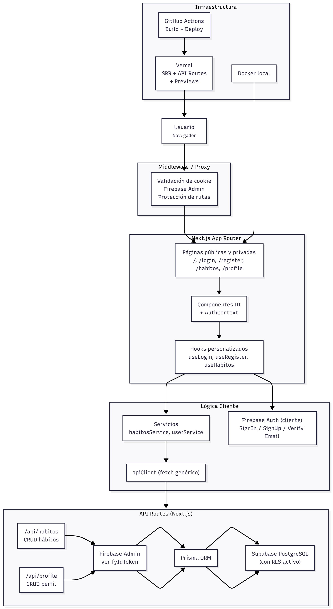
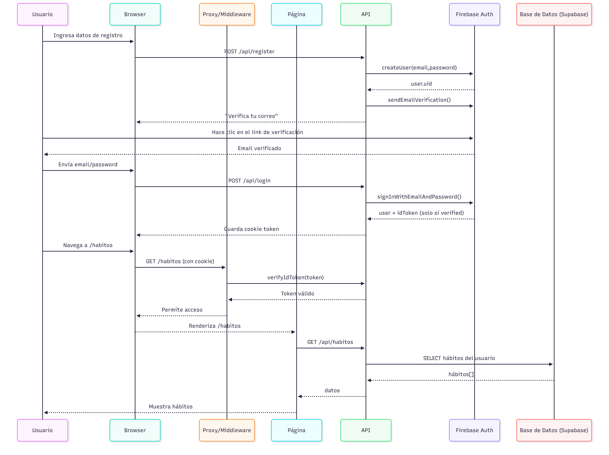

# Proyecto hábitos diarios

Aplicación web para llevar un seguimiento de hábitos diarios por usuario.

---

## Stack Tecnológico

- **Next.js (App Router) + React + TypeScript**
- **Tailwind CSS** para estilos
- **Prisma ORM** sobre **PostgreSQL (Supabase)**
- **Firebase Auth** para autenticación de usuarios
- **Vercel** para deploy de la app Next (SSR + API Routes)
- **Docker** (Dockerfile + `docker-compose.yml`) para entorno local / pruebas
- **GitHub Actions** para CI/CD (deploys de preview en PR y producción en Vercel)

---

## Diagramas (docs)

- **Modelo base de datos (ERD)**  
   `erdV3.png` muestra las tablas `users` y `habitos` y su relación 1:N (un usuario tiene muchos hábitos).

---


- **Diagrama de arquitectura**  
   `diagramaArquitecturaV3.png` muestra el flujo: Usuario → Proxy/Middleware → Páginas Next → Hooks/Servicios → API Routes → Prisma → Supabase, más Docker y GitHub Actions + Firebase Hosting para deploy.

---



- **Diagrama de secuencia**

  `diagramaSecuencia.png` resume el flujo de login con Firebase Auth y la carga/gestión de hábitos a través de las APIs protegidas.

---



---

## Cómo ejecutar el proyecto

### 1. Requisitos

- Node.js 20+
- npm
- (Opcional) Docker y Docker Compose

### 2. Variables de entorno (resumen)

Crea un archivo `.env.local` (para desarrollo) con, al menos:

- Conexión a base de datos (Supabase / PostgreSQL):
  - `DIRECT_URL=postgresql://...`
- Firebase (cliente):
  - `NEXT_PUBLIC_FIREBASE_API_KEY=...`
  - `NEXT_PUBLIC_FIREBASE_AUTH_DOMAIN=...`
  - `NEXT_PUBLIC_FIREBASE_PROJECT_ID=...`
  - `NEXT_PUBLIC_FIREBASE_STORAGE_BUCKET=...`
  - `NEXT_PUBLIC_FIREBASE_MESSAGING_SENDER_ID=...`
  - `NEXT_PUBLIC_FIREBASE_APP_ID=...`
- Firebase Admin (servidor):
  - `CLIENT_EMAIL_FIREBASE=...`
  - `PRIVATE_KEY_FIREBASE=...`

> Nota: los nombres exactos (por ejemplo `CLIENT_EMAIL_FIREBASE`, `PRIVATE_KEY_FIREBASE`) se pueden ver en `src/lib/firebase.ts` y `src/lib/firebaseAdmin.ts`.

### 3. Desarrollo local (sin Docker)

```bash
npm install
npm run dev
```

La app quedará disponible normalmente en `http://localhost:3000`.

### 4. Ejecución con Docker

```bash
docker-compose up --build
```

Esto levanta un contenedor con la app en el puerto `3000` usando el `Dockerfile` y `.env.production`.

---

## Deploy en producción (Vercel)

La app está pensada para desplegarse en **Vercel**:

- Conecta el repositorio en Vercel.
- Configura las variables de entorno (las mismas de `.env.local`, usando los prefijos `NEXT_PUBLIC_*`, `CLIENT_EMAIL_FIREBASE`, `PRIVATE_KEY_FIREBASE`, `DIRECT_URL`, etc.).
- Cada push a la rama configurada (por ejemplo `main`) puede disparar un nuevo deploy automático o controlado mediante GitHub Actions (ver sección de CI/CD más abajo).

---

## Flujo de autenticación y verificación de correo

1. **Registro (cliente)**
   - `useRegister` crea la cuenta con `firebase/auth`.
   - Se fuerza que el correo sea de dominios populares (`gmail.com`, `hotmail.com`, `outlook.com`, `live.com`, `yahoo.com`) y que la contraseña tenga mínimo 8 caracteres.
   - Tras crear el usuario se envía automáticamente el correo de verificación y se cierra la sesión local (`logoutUser`) para evitar que el usuario quede logueado sin confirmar.
   - Finalmente se redirige a `/login`.

2. **Verificación obligatoria**
   - `loginUser` llama a `signInWithEmailAndPassword`, pero antes de emitir la cookie revisa `user.emailVerified`.
   - Si no está verificado, reenvía el correo (`sendEmailVerification`), cierra la sesión y lanza el error `email-not-verified`.
   - `useLogin` captura ese error y muestra “Debes verificar tu correo antes de iniciar sesión…”.

3. **Cookies de sesión**
   - Cuando el correo ya está verificado, `loginUser` pide el `idToken` y lo guarda en la cookie `token`.
   - Ese token se usa en `requireNoAuth` y en todas las API Routes para validar al usuario mediante Firebase Admin (`auth.uid()`).

4. **Protecciones en la UI**
   - `LoginClient` y `RegisterClient` solo consideran “autenticado” a un usuario con `emailVerified`.
   - Si un usuario sin verificar navega atrás/adelante entre `/login` y `/register`, las pantallas se renderizan normal

## Detalles tecnicos actuales

- La cookie de sesión HTTP-only se llama actualmente `__session` y se crea a traves de la API `/api/auth/session` usando Firebase Admin.
- `SESSION_COOKIE_NAME` y `SESSION_COOKIE_MAX_AGE_MS` se definen en `src/lib/constants.ts` (por defecto `__session` con duraciónn de 7 dias).
- `proxy.ts` y `requireNoAuth` leen la cookie `__session` para decidir las redirecciones y protección de rutas.
- Para Firebase Admin en el backend se usan las variables `CLIENT_EMAIL_FIREBASE` y `PRIVATE_KEY_FIREBASE` (ver tambien `.env.production`).

## APIs y flujo de datos

### Perfil (`/api/profile`)

| Método | Ruta                   | Descripción                                  |
| ------ | ---------------------- | -------------------------------------------- |
| POST   | `/api/profile`         | Guarda `uid`, `email`, `username` en BD      |
| GET    | `/api/profile?uid=UID` | Devuelve el `username` asociado al `uid`     |
| PUT    | `/api/profile`         | Actualiza `username` y/o `email` del usuario |

### Hábitos (`/api/habitos`)

| Método | Ruta               | Descripción                               |
| ------ | ------------------ | ----------------------------------------- |
| GET    | `/api/habitos`     | Lista hábitos del usuario autenticado     |
| POST   | `/api/habitos`     | Crea un hábito (fecha + título + desc)    |
| PUT    | `/api/habitos/:id` | Actualiza campos (label, desc, completed) |
| DELETE | `/api/habitos/:id` | Elimina un hábito propio                  |

Todas las rutas anteriores verifican el token con **Firebase Admin** antes de invocar Prisma/Supabase.

---

## Panel de usuario (`/profile`)

- Permite ver y actualizar datos de la cuenta del usuario autenticado.
- **Nombre de usuario**:
  - Muestra el username actual (obtenido desde `/api/profile?uid=UID`).
  - Permite cambiarlo mediante un formulario simple que llama a `PUT /api/profile`.
- **Correo**:
  - Muestra el correo actual (de Firebase Auth).
  - Pide un nuevo correo y la contraseña actual del usuario.
  - Reautentica al usuario con `reauthenticateWithCredential` y luego llama a `verifyBeforeUpdateEmail`, que envía un correo de verificación al nuevo email.
  - Sincroniza el nuevo correo en la tabla `users` con `PUT /api/profile` y maneja el caso de correo ya usado (409).
- **Contraseña**:
  - Pide contraseña actual, nueva contraseña y confirmación.
  - Valida longitud mínima (8 caracteres) y que ambas contraseñas coincidan.
  - Reautentica con la contraseña actual y luego ejecuta `updatePassword` en Firebase Auth.
  - Tras cambios sensibles (correo o contraseña) se abre un modal que sugiere volver a iniciar sesión por seguridad.

## Policies RLS en Supabase

Con RLS activado en `public.users` y `public.habitos`, se aplican estas políticas (basadas en `auth.uid()`):

```sql
-- USERS
CREATE POLICY "insert own profile"
  ON public.users
  FOR INSERT
  WITH CHECK (auth.jwt()->>'sub' = uid);

CREATE POLICY "select own profile"
  ON public.users
  FOR SELECT
  USING (auth.jwt()->>'sub' = uid);

CREATE POLICY "update own profile"
  ON public.users
  FOR UPDATE
  USING (auth.jwt()->>'sub' = uid)
  WITH CHECK (auth.jwt()->>'sub' = uid);

-- HABITOS
CREATE POLICY "insert own habit"
  ON public.habitos
  FOR INSERT
  WITH CHECK (auth.jwt()->>'sub' = user_id);

CREATE POLICY "select own habits"
  ON public.habitos
  FOR SELECT
  USING (auth.jwt()->>'sub' = user_id);

CREATE POLICY "update own habits"
  ON public.habitos
  FOR UPDATE
  USING (auth.jwt()->>'sub' = user_id)
  WITH CHECK (auth.jwt()->>'sub' = user_id);

CREATE POLICY "delete own habits"
  ON public.habitos
  FOR DELETE
  USING (auth.jwt()->>'sub' = user_id);

```

## Resumen del flujo completo

1. El usuario se registra (`useRegister`) → se valida dominio/contraseña → se envía verificación y se cierra sesión.
2. Hace clic en el correo de verificación → vuelve a `/login`.
3. Inicia sesión (`useLogin`) → si el correo está verificado se genera cookie `token`.
4. `requireNoAuth` y `proxy.ts` usan Firebase Admin para decidir si envían al usuario a `/habitos` o al login.
5. Las API Routes (`/api/habitos`, `/api/profile`) validan la cookie y ejecutan Prisma.
6. Supabase aplica las policies RLS para que cada usuario solo lea/escriba sus filas.
