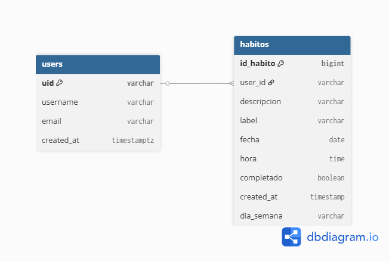
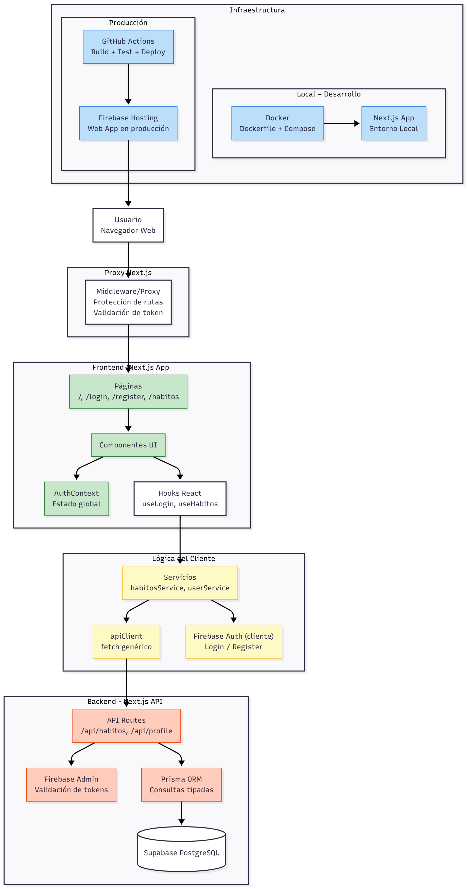
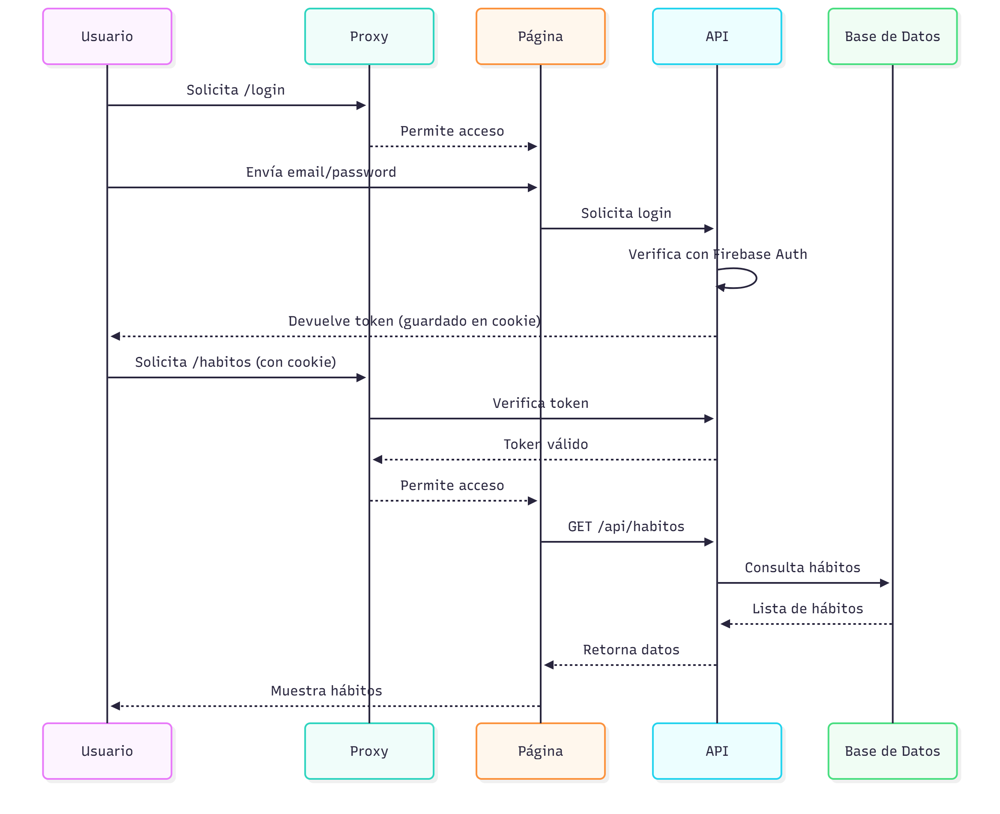

# Proyecto hábitos diarios

Aplicación web para llevar un seguimiento de hábitos diarios por usuario.

---

## Stack Tecnológico

- **Next.js (App Router) + React + TypeScript**
- **Tailwind CSS** para estilos
- **Prisma ORM** sobre **PostgreSQL (Supabase)**
- **Firebase Auth** para autenticación de usuarios
- **Firebase Hosting** para deploy (vía GitHub Actions a futuro)
- **Docker** (Dockerfile + `docker-compose.yml`) para entorno local / pruebas

---

## Diagramas (docs)

- **Modelo base de datos (ERD)**  
   `erdV3.png` muestra las tablas `users` y `habitos` y su relación 1:N (un usuario tiene muchos hábitos).
  

- **Diagrama de arquitectura**  
   `diagramaArquitecturaV3.png` muestra el flujo: Usuario → Proxy/Middleware → Páginas Next → Hooks/Servicios → API Routes → Prisma → Supabase, más Docker y GitHub Actions + Firebase Hosting para deploy.
  

- **Diagrama de secuencia**  
   `diagramaSecuencia.png` resume el flujo de login con Firebase Auth y la carga/gestión de hábitos a través de las APIs protegidas.
  

---

## Cómo ejecutar el proyecto

### 1. Requisitos

- Node.js 20+
- npm
- (Opcional) Docker y Docker Compose

### 2. Variables de entorno (resumen)

Crea un archivo `.env.local` (para desarrollo) con, al menos:

- Conexión a base de datos (Supabase / PostgreSQL):
  - `DIRECT_URL=postgresql://...`
- Firebase (cliente):
  - `NEXT_PUBLIC_FIREBASE_API_KEY=...`
  - `NEXT_PUBLIC_FIREBASE_AUTH_DOMAIN=...`
  - `NEXT_PUBLIC_FIREBASE_PROJECT_ID=...`
  - `NEXT_PUBLIC_FIREBASE_STORAGE_BUCKET=...`
  - `NEXT_PUBLIC_FIREBASE_MESSAGING_SENDER_ID=...`
  - `NEXT_PUBLIC_FIREBASE_APP_ID=...`
- Firebase Admin (servidor):
  - `FIREBASE_CLIENT_EMAIL=...`
  - `FIREBASE_PRIVATE_KEY=...`

> Nota: los nombres exactos se pueden ver en `src/lib/firebase.ts` y `src/lib/firebaseAdmin.ts`.

### 3. Desarrollo local (sin Docker)

```bash
npm install
npm run dev
```

La app quedará disponible normalmente en `http://localhost:3000`.

### 4. Ejecución con Docker

```bash
docker-compose up --build
```

Esto levanta un contenedor con la app en el puerto `3000` usando el `Dockerfile` y `.env.production`.

---

## Endpoints API actuales

### Perfil de usuario (`/api/profile`)

> Se usa junto con Firebase Auth: primero se crea el usuario en Firebase, luego se guarda/lee su info adicional en la base de datos.

| Método | Ruta                   | Descripción                          |
| ------ | ---------------------- | ------------------------------------ |
| POST   | `/api/profile`         | Crea/asegura el registro del usuario |
| GET    | `/api/profile?uid=UID` | Obtiene el `username` por `uid`      |

### Hábitos (`/api/habitos`)

Todos estos endpoints requieren un **token válido** en la cookie (Firebase ID Token). El middleware y las rutas validan el token antes de acceder a la base de datos.

| Método | Ruta               | Descripción                           |
| ------ | ------------------ | ------------------------------------- |
| GET    | `/api/habitos`     | Lista hábitos del usuario autenticado |
| POST   | `/api/habitos`     | Crea un nuevo hábito                  |
| PUT    | `/api/habitos/:id` | Actualiza un hábito existente         |
| DELETE | `/api/habitos/:id` | Elimina un hábito existente           |

La autenticación (login/registro) se hace en el **cliente** usando Firebase Auth (no existen endpoints `/api/auth/*` en este proyecto). El token se guarda en una cookie y se verifica en:

- El **middleware/proxy** (`src/proxy.ts`) para proteger rutas como `/habitos`.
- Las **API Routes** (`/api/habitos`, `/api/profile`) usando Firebase Admin y Prisma.
